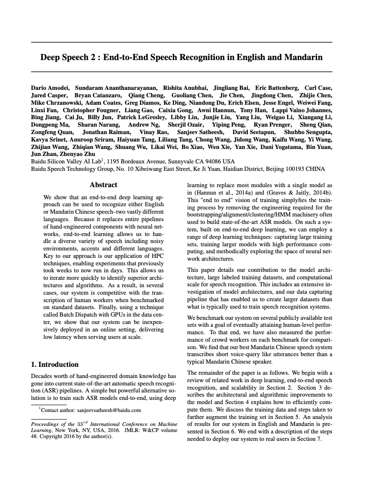
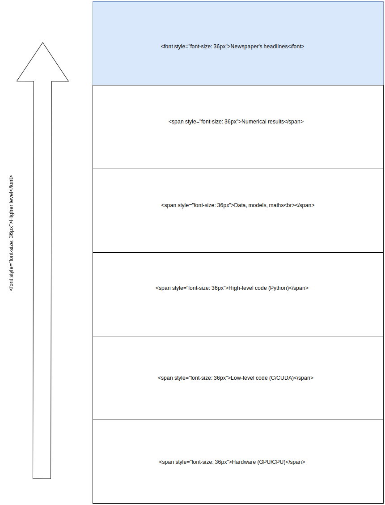
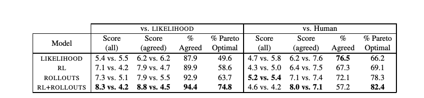
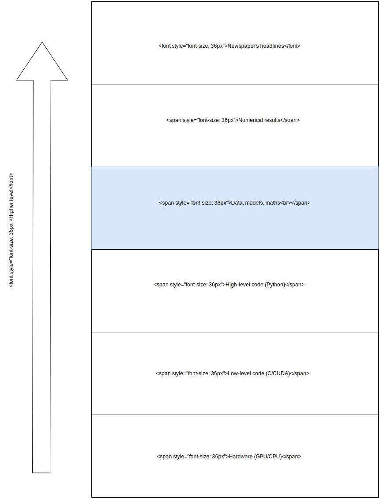
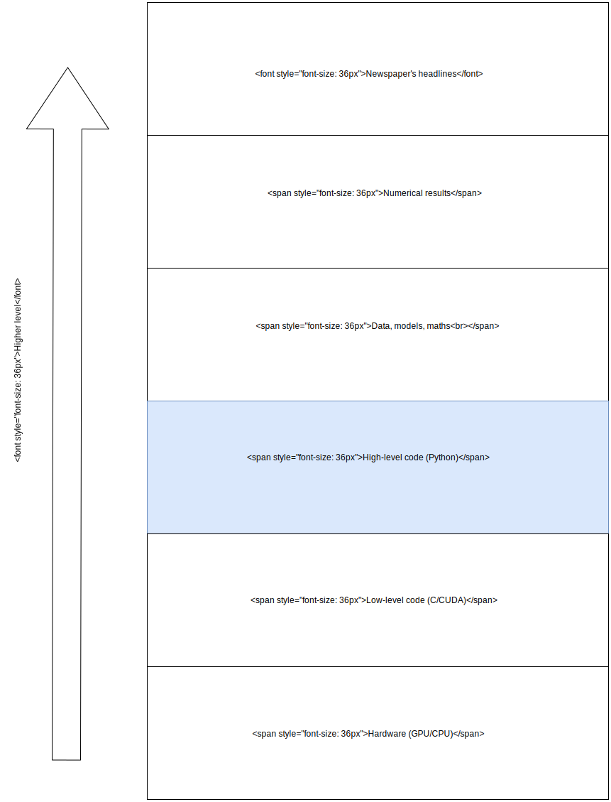
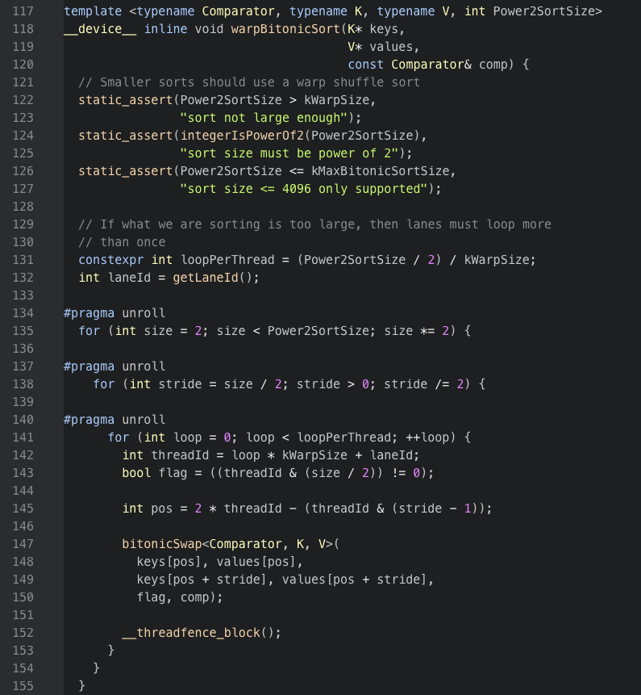
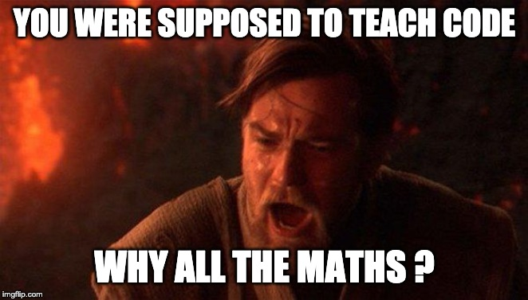

class: center, middle

# AMMI Deep Learning DIY:
# Day 1
Alexandre Sablayrolles, Pierre Stock

---
name:objectives
# Deep Learning DIY: Objectives

Given an idea or a project, be able to implement it in a robust way

---
template:objectives
- Ex: "Given a set of images, can I find the best classifier ?"

  

---
template:objectives
- Ex: "With a conversation dataset, how can I create a chatbot ? How can I build a translation model ?"

  

---
template:objectives
- Ex: "I don't know anything about speech recognition. Can I read a couple of papers and get started on a model ?"

  

  

---
template:objectives
- Write code from scratch

--
 - Write a training loop, a dataloader, etc.

--
 - Already know what to do (generic machine learning code) when the project starts

---
template:objectives
- Write code from scratch
- Debug the project, from code to machine learning assumptions

--
  - did I use the right parameters (learning rate, optimizer, etc.) ?

--
  - am I sure that my evaluation is correct ?

--
  - are the training and test set different ?

--
  - my model does not work on this data, does it work on other data ?

---
template:objectives
- Write code from scratch
- Debug the project, from code to machine learning assumptions
- Top-down approach to understanding

--
  - there are a lot of moving parts, but we nail them down progressively

---
name:objectives
# Deep Learning DIY: Objectives

Given an idea or a project, be able to implement it in a <u>robust</u> way
- Write code from scratch
- Debug the project, from code to machine learning assumptions
- Top-down approach to understanding

---
# Teachers

Pierre Stock

  

  2nd year PhD Student at Facebook AI Research.   
  Working on model compression, computer vision, deep learning.  

---
# Teachers

Timothée Lacroix

  

  Finishing PhD Student at Facebook AI Research.   
  Working on learning embeddings for large-scale datasets, tensor factorization, etc.  

---
# Teachers

Alexandre Sablayrolles

  

  3rd year PhD Student at Facebook AI Research.   
  Working on fast nearest neighbor search and differential privacy.  

---
# Schedule (Tentative)

First week

--
- Monday:   Logistic regression & the basics of debugging

--
- Tuesday:  Homework (debugging, model & parameter search)

--
- Wednesday: Data visualization (PCA, t-SNE)

--
- Thursday:  Homework (Data visualization)

--
- Friday:   Convnets, vision

--

Second week

--
- Monday: Natural Language Processing

--
- Tuesday: Homework (NLP)

--
- Wednesday: Reinforcement Learning

--
- Thursday: Homework (project)

--
- Friday:  Homework & grading

---

# Outline

1. The machine learning stack
2. Brief recap: gaussian random variables
3. Logistic regression and linear classification
4. How to debug a machine learning code?

---
class: outline

# Outline

<ol>
<li class="outline_current">The machine learning stack</li>
<li>Brief recap: gaussian random variables</li>
<li>Logistic regression and linear classification</li>
<li>How to debug a machine learning code?</li>
</ol>

---
# The various levels of machine learning...

  

  

---
# The various levels of machine learning...

  

  

---
# The various levels of machine learning...

  

  

---
# The various levels of machine learning...

  

  

---
# The various levels of machine learning...

  

  

---
# The various levels of machine learning...

  

  

---
# ... and their corresponding bugs

  

"We created a Terminator" VS
"Small neural nets learned to communicate"

---
# ... and their corresponding bugs

  

 
 
 
"We solved vision" VS "We got 1% improvement on Imagnet"

---
# ... and their corresponding bugs

  

 
 
 
 
 
 
"We can recognize tanks/cars VS we can recognize day/night"

---
# ... and their corresponding bugs

  

 
 
 
 
 
 
 
 
 
"This model does not work" VS "I forgot to learn the parameters"

---
# ... and their corresponding bugs

  

 
 
 
 
 
 
 
 
 
 
 
"My model is slow" VS "I did not use optimized functions"

---
# ... and their corresponding bugs

  

 
 
 
 
 
 
 
 
 
 
 
 
 
"My model cannot fit large data" VS "I did not use the right GPU setting "

---
class: outline

# Outline

<ol>
<li>The machine learning stack</li>
<li class="outline_current">Brief recap: gaussian random variables</li>
<li>Logistic regression and linear classification</li>
<li>How to debug a machine learning code?</li>
</ol>

---
class: outline

# Outline

<ol>
<li>The machine learning stack</li>
<li>Brief recap: gaussian random variables</li>
<li class="outline_current">Logistic regression and linear classification</li>
<li>How to debug a machine learning code?</li>
</ol>

---

# Logistic regression

- We want to separate two gaussians
- Generating process: for a class \\(y \in \\{0, 1\\}\\), we generate \\(x\\):
$$ P(x|y=0) = C \exp(-\\| x - \mu_0 \\|^2) $$
$$ P(x|y=1) = C \exp(-\\| x - \mu_1 \\|^2) $$

---
# Logistic regression
- In machine learning, we observe \\(x\\) and want to infer \\(y\\)
$$ P(y=1|x) = ? $$

--
- We can apply Bayes'rule:
$$ P(y=1|x) = \frac{P(y=1, x)}{P(x)} $$
$$ P(y=1|x) = \frac{\textcolor{blue}{P(x|y=1)P(y=1)}}{\textcolor{blue}{P(x|y=1)P(y=1)} + \textcolor{green}{P(x|y=0)P(y=0)}} $$

---
# Logistic regression
- Logistic function \\( \sigma(x) = 1 / (1 + \exp(-x)) \\)

--
- We have:
$$ \frac{\textcolor{blue}{a}}{\textcolor{blue}{a} + \textcolor{green}{b}} = \sigma \left( -\log \left( \frac{\textcolor{green}{b}}{\textcolor{blue}{a}}\right) \right) $$

--
- Hence:
$$ P(y=1|x) = \sigma \left( -\log \left( \frac{\textcolor{green}{P(x|y=0)P(y=0)}}{\textcolor{blue}{P(x|y=1)P(y=1)}}\right) \right) $$

---
# Logistic regression
- We assume balanced classes: \\(\textcolor{green}{P(y=0)} = \textcolor{blue}{P(y=1)}\\)

--
- Let's work out the term inside \\( \sigma \\):
$$ -\log \left( \frac{\textcolor{green}{P(x|y=0)P(y=0)}}{\textcolor{blue}{P(x|y=1)P(y=1)}} \right) = -\log \left( \frac{\textcolor{green}{C \exp(-\frac{1}{2}\\|x-\mu_0\\|^2)}}{\textcolor{blue}{C \exp(-\frac{1}{2}\\|x-\mu_1\\|^2)}} \right) $$

--
$$ \qquad\qquad\qquad\qquad\qquad\qquad\;\, = \textcolor{green}{\frac{1}{2}\\|x-\mu_0\\|^2} - \textcolor{blue}{\frac{1}{2}\\|x-\mu_1\\|^2} $$

--
$$ \qquad\qquad\qquad\qquad\qquad\qquad\;\, = \langle x, \mu_1 - \mu_0 \rangle + \frac{ \\| \mu_1 \\|^2 - \\| \mu_0 \\|^2 }{2}  $$

--
- Our loss function is
$$ -\log \left( P(y=1|x) \right) = -\log \left( \sigma \left(\langle x, \mu_1 - \mu_0 \rangle + \frac{ \\| \mu_1 \\|^2 - \\| \mu_0 \\|^2 }{2} \right) \right)$$

---
# Logistic regression

- Our loss function writes as:
$$ -\log \left( P(y=1|x) \right) = f \left( \langle x, w \rangle - b  \right)$$
where \\(w = \mu_1 - \mu_0\\), \\(\quad b = - \frac{ \\| \mu_1 \\|^2 - \\| \mu_0 \\|^2 }{2} \\), and:
$$ f(u) = -\log(\sigma(u)) $$
$$ \qquad \qquad \qquad \;\; = - \log \left( \frac{1}{1 + \exp(-u)} \right) $$
$$ \qquad \qquad \;\; = \log(1 + \exp(-u)) $$

---
# Logistic regression

  

---
# Why the maths

- Why we do the maths

--
  - __Understand__: why do we do logistic regression ?

--
  - __Debug__: Gaussians are a simple case to test our code

--
  - __Visualize__: put some sense back into equations

---
# Logistic regression
- For (x, y=1), we want to maximize \\( P(y=1|x) \\). We have:
$$ -\log \left( P(y=1|x) \right) = f \left( \langle x, w \rangle - b  \right) $$
- For (x,y=0), we want to maximize \\( P(y=0|x)\\). We can show:
$$ -\log \left( P(y=0|x) \right) = f \left( - \left( \langle x, w \rangle - b  \right) \right) $$
- If we call \\( t_i = 2*y_i-1 \\), we have:
$$ -\log \left( P(y=y_i|x_i) \right) = f \left( t_i \left( \langle x_i, w \rangle - b  \right) \right) $$
- Over the whole dataset, we minimize:
$$ \mathcal{L}(w) = \frac{1}{n} \sum_{i=1}^n f(t_i  \left( \langle x_i, w \rangle - b  \right)  ) $$

---
# Logistic regression
- Trick: \\( \langle x, w \rangle - b = \langle \tilde{x}, \tilde{w} \rangle \\), with
  - \\( \tilde{x} = \[x, -1\] \\)
  - \\( \tilde{w} = \[w, b\] \\)

--
- If \\( t_i = 1 \\), we expect \\( \langle x_i, w \rangle - b \geq 0 \\)
- If \\( t_i = -1 \\), we expect \\( \langle x_i, w \rangle - b \leq 0 \\)
- In general, \\( t_i (\langle x_i, w \rangle - b) \geq 0 \\) iff we classified correctly

  

---
# What does the loss look like ?

  

---
# Gradients

- How do we learn the model ?

---
name: gd
# Gradients

- How do we learn the model ?
- Gradient descent!

--

---
template: gd

- (Negative) gradient is:
$$ - \nabla \mathcal{L}(\tilde{w}) = \frac{1}{n} \sum_{i=1}^n \sigma( -t_i \langle \tilde{x_i}, \tilde{w} \rangle ) t_i \tilde{x_i}  $$

--
- Do you believe me ?

--
- Looking at the formula, can you convince yourself ?

---
template: gd

- (Negative) gradient is:
$$ - \nabla \mathcal{L}(\tilde{w}) = \textcolor{green}{\frac{1}{n} \sum_{i=1}^n} \sigma( -t_i \langle \tilde{x_i}, \tilde{w}  \rangle ) t_i \tilde{x_i}  $$

---
template: gd

- (Negative) gradient is:
$$ - \nabla \mathcal{L}(\tilde{w}) = \frac{1}{n} \sum_{i=1}^n \sigma( -t_i \langle \tilde{x_i}, \tilde{w} \rangle ) \textcolor{green}{ t_i \tilde{x_i} } $$

---
template: gd

- (Negative) gradient is:
$$ - \nabla \mathcal{L} = \frac{1}{n} \sum_{i=1}^n \textcolor{green}{\sigma( -t_i \langle \tilde{x_i}, \tilde{w} \rangle )}  t_i \tilde{x_i} $$

  

---
# Gradients
- Now you believe the maths, but how do you believe your implementation ?

--
- Gradcheck!

--
- The gradient is the vector of component-wide derivatives

--
- We can compare the gradient to its finite-difference approximation
$$ \nabla \mathcal{L}_j \approx \frac{\mathcal{L}(\tilde{w} + \epsilon~e_j) - \mathcal{L}(\tilde{w} - \epsilon~e_j)}{2~ \epsilon}$$
