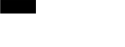
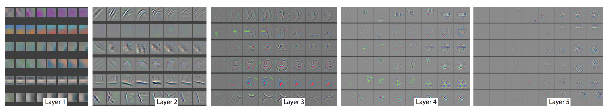
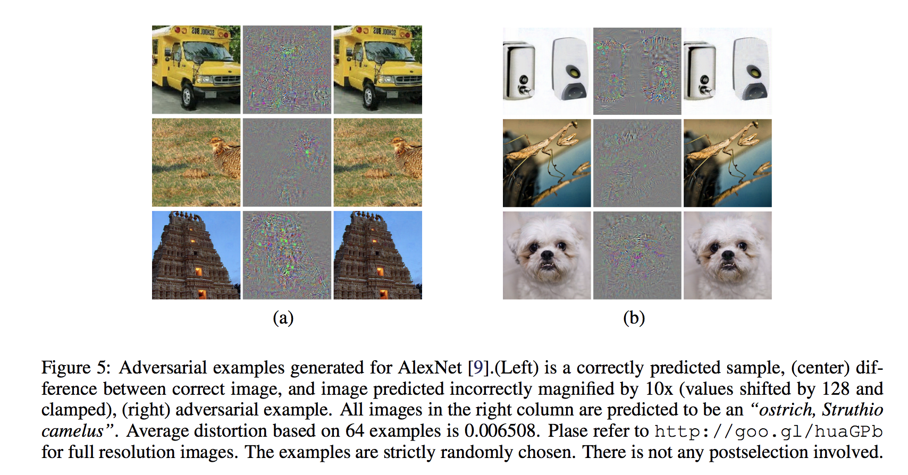
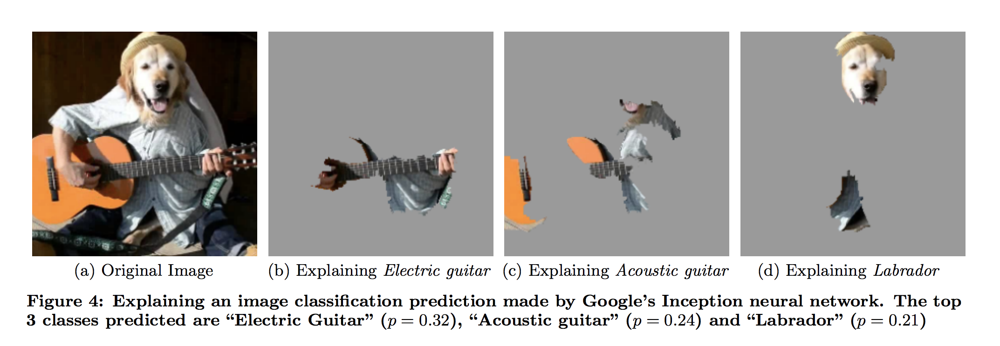

class: center, middle

# Deep Learning DIY:
# Opening the black box
Alexandre Sablayrolles

---
name:recipe

# The Deep learning recipe

Deep learning recipe:
- Take a large dataset and a large model
- Learn it using the classical recipe (SGD, ReLU, BatchNorm)

How do we make sure that our model works ?

---
template:recipe
- We can look at its performance on a validation set

---
template:recipe
- We can look at its performance on a validation set
- We will know that it works, but not _how_

---

# Motivation: opening the black box

It is important to understand how our models work, in particular for:
- debugging our training code / algorithm
- getting ideas on how to improve the model
- be compliant with regulations if our model is used in production
- transfer learning makes all this very important

---

# Outline

1. Motivation
2. Looking at network activations
3. Maximizing responses from images
4. Maximizing responses from noise
5. Minimizing responses from images: adversarial examples
5. Localizing content
6. Understanding influence
7. Summary
8. Going further

---
# Notations

.center[]

\\( h\_i \\) is the tensor of the activations at hidden layer i.
It is a 3-D tensor (width, height and number of channels) for convolutional layers,
and a 1-D tensor for fully connected layers.
 
We are interested in knowing what \\( h\_i \\) contains.
For this, there are mainly two types of methods:
- direct analysis of \\( h\_i \\) for various images
- modify the content of the image to maximize some activation of \\( h\_i \\)

---
class: outline

# Outline

<ol>
<li>Motivation</li>
<li class="outline_current">Looking at network activations</li>
<li>Maximizing responses from images</li>
<li>Maximizing responses from noise</li>
<li>Minimizing responses from images: adversarial examples</li>
<li>Localizing content</li>
<li>Understanding influence</li>
<li>Summary</li>
<li>Going further</li>
</ol>

---
# Activation maps

Basic idea: ReLU represent how useful the signal is:
- if a ReLU is activated (> 0), the signal useful to predict the class
- if a ReLU is not activated (< 0), the signal is useless

.center[]

---
# Visualization of activations

We can use an off-the-shelf visualization method and apply it to our activations.

t-SNE is one of the most used visualization methods:

- it maps high-dimensional data to 2-d points
- it preserves local nearest neighbors

.citation[Credit: Fabian Keller]

---
# Visualization of activations

We can run t-sne on the last activation of the neural net.

.citation[Credit: CS231N class, Stanford]

---

# Inverting deep image representations

Mahendran et al. [1] assess how much information \\(h_i\\) contains by trying to reconstruct the image from it.

$$ \max\_{z} \Phi\_i(z) \cdot h\_i $$

Start from a random z and update it to minimize the cost function above.

.citation[[1] Understanding Deep Image Representations by Inverting Them, Mahendran et al.]

---

# Inverting deep image representations

.citation[[1] Understanding Deep Image Representations by Inverting Them, Mahendran et al.]

We are able to get most of the picture right from the 1,000 dimensional vector at the end of the network.
This means that the vector contains most of the "pixel" information.

---
class: outline

# Outline

<ol>
<li>Motivation</li>
<li>Looking at network activations</li>
<li class="outline_current">Maximizing responses from images</li>
<li>Maximizing responses from noise</li>
<li>Minimizing responses from images: adversarial examples</li>
<li>Localizing content</li>
<li>Understanding influence</li>
<li>Summary</li>
<li>Going further</li>
</ol>

---

# Playing with the input to understand activations

Now instead of using the activations provided by the neural network, we want to force the network to produce a given activation, by modifying the input.

 
Either find the image that maximizes the given neuron:
$$ \max\_{x~\text{img}} \Phi\_i(x) \cdot h\_{\text{target}} $$
Or, given an image, find the direction that maximizes the given neuron:
$$ \min\_{z\in\mathbb{R}^d} \Phi\_i(x + z) \cdot h\_{\text{target}} $$

---

# Filters of the first layers

For the first layer, it is easy: taking the weights as input maximizes the convolution.

.citation[ImageNet Classification with Deep Convolutional Neural Networks, Krizhevsky et al.]

---

# Filters of the first layers

These filters are learned automatically by the network and look like Gabor filters, known by the signal processing community to have desirable properties.

---

# Filters of further layers

Beyond the first layer, it is not straightforward to identify typical patterns that activate neurons.
Zeiler and Fergus use SGD to maximally activate a given neuron.

.citation[Visualizing and Understanding Convolutional Networks, Zeiler and Fergus]

---

# Guided backpropagation

Guided backpropagation is a variant of this method that produces better-looking patterns.

.citation[Slide credit: Stanford CS231N]

---

class: outline

# Outline

<ol>
<li>Motivation</li>
<li>Looking at network activations</li>
<li>Maximizing responses from images</li>
<li class="outline_current">Maximizing responses from noise</li>
<li>Minimizing responses from images: adversarial examples</li>
<li>Localizing content</li>
<li>Understanding influence</li>
<li>Summary</li>
<li>Going further</li>
</ol>

---

# Starting from noise to maximize activations

We still try to get a response at a given layer:

But instead of modifying actual images:
$$ \max\_{z\in\mathbb{R}^d} \Phi\_i(x + z) \cdot h\_{\text{target}}, $$

we start from random noise:
$$ \max\_{z\in\mathbb{R}^d} \Phi\_i(\color{red} z) \cdot h\_{\text{target}}. $$

---

# Deep visualization

Yosinski et al. [1] show what happens if we maximize the activation of a given class:

We can see patterns that look like typical objects.

.citation[[1] Understanding Neural Networks Through Deep Visualization]
---

class: outline

# Outline

<ol>
<li>Motivation</li>
<li>Looking at network activations</li>
<li>Maximizing responses from images</li>
<li>Maximizing responses from noise</li>
<li class="outline_current">Minimizing responses from images: adversarial examples</li>
<li>Localizing content</li>
<li>Understanding influence</li>
<li>Summary</li>
<li>Going further</li>
</ol>

---
name: adversarial1
# Minimizing responses: adversarial examples

Now, what if instead of maximizing response of a neuron:
$$ \max\_{z\in\mathbb{R}^d} \Phi\_i(x + z) \cdot h\_{\text{target}}, $$

we minimize it:
$$ \color{red}{\min} \_{z\in\mathbb{R}^d} \Phi\_i(x + z) \cdot h\_{\text{target}}. $$

---
template: adversarial1
name: adversarial2

We obtain a small perturbation \\( z \\) that will "fool" our network.
---
template: adversarial2

\\(z\\) is called and _adversarial perturbation_.

---

# Adversarial examples

This phenomenon was first described by Szegedy et al. [1].

.citation[[1] Intriguing properties of neural networks]

---

# Opening Pandora's box

Adversarial examples are actual images (i.e. RGB values with range [0, 255]).

There are a variety of adversarial examples, e.g. Adversarial Patch (Brown et al.)

---

# Defense against the dark arts

Adversarial examples are considered a real danger for production environments.
Potential threats include:
- bypassing filters for nude/terrorist content on social media
- fooling self-driving cars
- face detection: unlocking phones

How to fight adversarial examples ?
- generate adversarial examples and train on them.
- regularize more (dropout, weight decay, ...)

Training on the adversarial examples works well but is really costly.

---

class: outline

# Outline

<ol>
<li>Motivation</li>
<li>Looking at network activations</li>
<li>Maximizing responses from images</li>
<li>Maximizing responses from noise</li>
<li>Minimizing responses from images: adversarial examples</li>
<li class="outline_current">Localizing content</li>
<li>Understanding influence</li>
<li>Summary</li>
<li>Going further</li>
</ol>

---

# Partial image occlusion

Measure of how the class activation responds to blanking out a square in the image.
 
blue => class not predicted correctly => blanked-out location was essential for prediction

---

# Localizing content with LIME

    

LIME [1] is a method that approximates a neural network locally by a simpler model to understand what contributes to the decision.

.citation[[1] Why Should I Trust You?, [Riberio et al.](https://arxiv.org/abs/1602.04938)]

---

# Exercise caution

  Although some methods help to localize what is "happening" in the image,
  recent work [1] has shown that it also happens with networks initialized randomly.
     

  Why does this happen ? The "salient" content in images is where there are edges.

  

.citation[[1] Sanity Checks for Saliency Maps, Adebayo et al.]

---

# Exercise caution

In general, such visualization methods look very good and are inspiring,
but keep a scientific mind:
- what knowledge am I getting from this visualization ?
- if I change X, does it change my visualizations ?

---

# Understanding influence

We know have a better idea of how neural net works once they are trained, but we don't
know how individual training examples contributed to converge to this model.
Koh et al. [1] recently developed an "influence score" for machine learning models,
that evaluates how much influence an element of the training set has on the class decision of an element of the test set:
<!-- \\(\int_a^bf(x)dx\\) -->
$$ \mathcal{I}\_{\text{up, loss}} (z, z\_{\text{test}}) = - \nabla\_{\theta} L(z\_{\text{test}}, \hat \theta) H\_{\theta}^{-1} \nabla\_{\theta} L(z, \hat \theta). $$

.citation[[1] Understanding Black-Box Predictions via Influence Functions]

<!-- https://arxiv.org/abs/1703.04730 Koh et al. -->

---

class: outline

# Outline

<ol>
<li>Motivation</li>
<li>Looking at network activations</li>
<li>Maximizing responses from images</li>
<li>Maximizing responses from noise</li>
<li>Minimizing responses from images: adversarial examples</li>
<li>Localizing content</li>
<li>Understanding influence</li>
<li class="outline_current">Summary</li>
<li>Going further</li>
</ol>

---

# Summary

<table style="width:100%">
  <tr>
    <th> Method </th>
    <th> Max/Min</th>
    <th> Input </th>
    <th> Activations: actual/target </th>
  </tr>
  <tr>
    <td>Inverting</td>
    <td>max</td>
    <td>noise</td>
    <td>actual</td>
  </tr>
  <tr>
    <td>Filters/deconv</td>
    <td>max</td>
    <td>image</td>
    <td>target</td>
  </tr>
  <tr>
    <td>Deep visualization</td>
    <td>max</td>
    <td>image</td>
    <td>target</td>
  </tr>
  <tr>
    <td>Adversarial examples</td>
    <td>min</td>
    <td>image</td>
    <td>target</td>
  </tr>
</table>

---

class: outline

# Outline

<ol>
<li>Motivation</li>
<li>Looking at network activations</li>
<li>Maximizing responses from images</li>
<li>Maximizing responses from noise</li>
<li>Minimizing responses from images: adversarial examples</li>
<li>Localizing content</li>
<li>Understanding influence</li>
<li>Summary</li>
<li class="outline_current">Going further</li>
</ol>

---

# Understanding NLP models

- visualizing word embeddings using t-sne.
- probe linguistic properties of sentence embeddings [1]
- gender bias in word embeddings [2]

.citation[[1]What you can cram into a single $&!#* vector, Conneau et al.
 
[2] [Post from MIT Tech Review](https://www.technologyreview.com/s/602025/how-vector-space-mathematics-reveals-the-hidden-sexism-in-language/)]

---

# More references

- [Blog post](https://distill.pub/2017/feature-visualization/) by Chris Olah on visualization
- [Talk](http://deeplearning.csail.mit.edu/slide_cvpr2018/been_cvpr18tutorial.pdf) by Been Kim at the CVPR'2018 tutorial on Interpretable Machine Learning for Computer Vision
- [Blog post](https://gandissect.csail.mit.edu/) for visualizing GANs
- [Slides](http://cs231n.stanford.edu/slides/2017/cs231n_2017_lecture12.pdf) on visualization from Stanford CS231N
